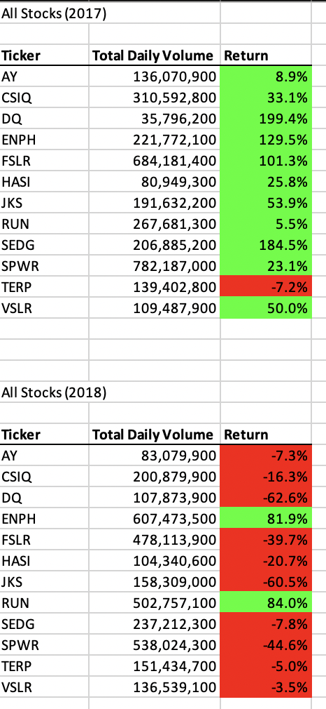
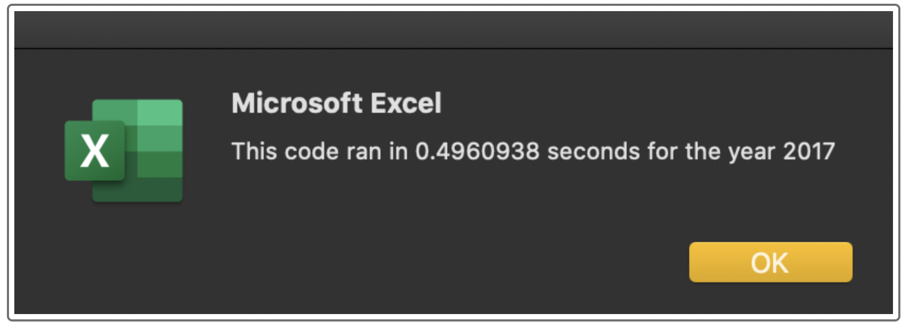

# Module 2

## Overview
The purpose of this analysis is to write a VBA script to analyze stock ticker data and output a summary on a separate tab.

## Results
Below are the stock summarization results:

The execution time is much faster with the new macro, compare for each year:
* 2017
  * Old: 
  * New: 
* 2018
  * Old: 
  * New: 

## Summary
1. What are the advantages or disadvantages of refactoring code?
   1. Advantages: Can make the code faster, more readable, easier to maintain, easier to prevent bugs in the future, easier to understand
   2. Disadvantages: It takes extra effort and time to refactor code, without changing the actual end result of the code. This time may be better spent elsewhere.
2. How do these pros and cons apply to refactoring the original VBA script?
   1. The script clearly runs much faster after the refactoring.
   2. The code is also much easier to understand now.
